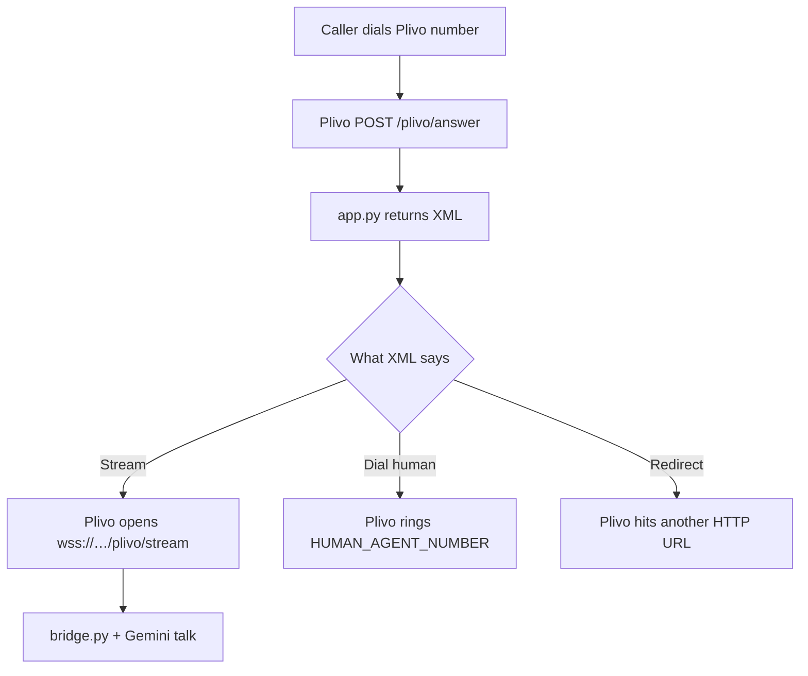
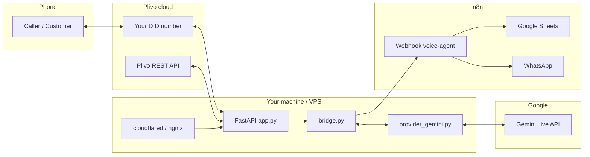
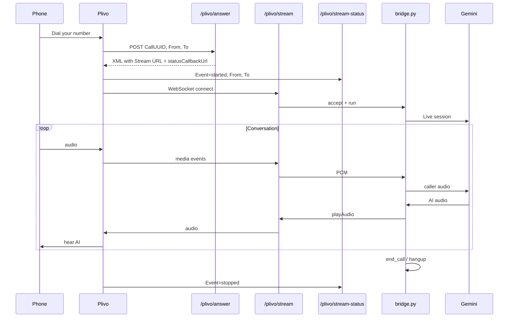
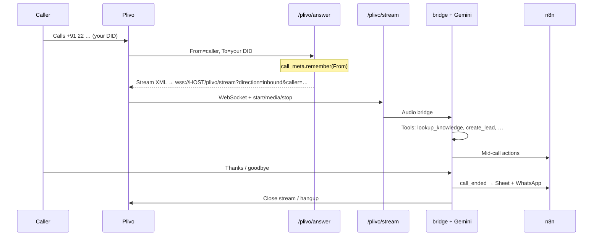
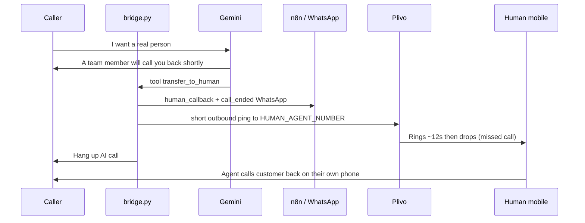
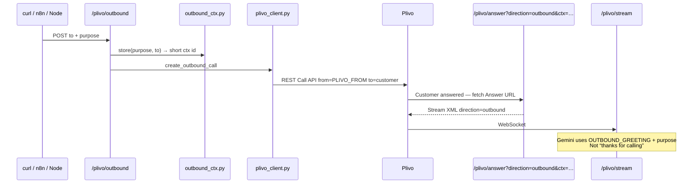
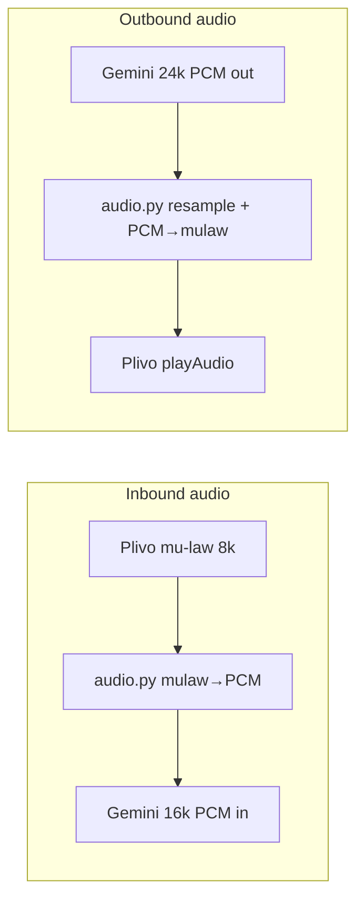
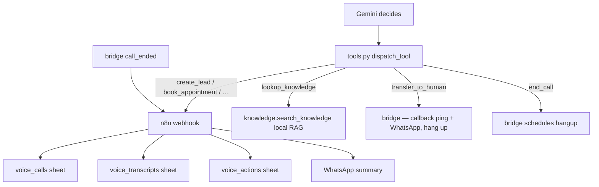

# Voice Agent — How Everything Connects

**Read this first** if you wonder: *“I only set `/plivo/answer` in Plivo — how do the other URLs work?”*

| Doc | Use when |
|-----|----------|
| **This file (`FLOW.md`)** | Understand architecture, URLs, files, call flows |
| [PLIVO_SETUP.md](PLIVO_SETUP.md) | Buy number, console clicks, first inbound call |
| [GUIDE.md](GUIDE.md) | `.env`, voice, n8n Sheets, troubleshooting |
| [DEPLOY.md](DEPLOY.md) | Run next to Node + nginx |
| [API_INTEGRATION.md](API_INTEGRATION.md) | Node / Web / Flutter APIs |

---

## 1. The one-line idea

```
Phone (Plivo)  ←audio→  Your Python bridge  ←speech→  Gemini Live
                              ↓ tools
                     n8n (Sheets/WA)  and/or  Node (DB)
```

You put **one** public URL in Plivo console: **`/plivo/answer`**.  
Everything else is started **by your server** (XML, WebSocket, or REST) — Plivo does not need those URLs pasted in the console.

---

## 2. Why only `/plivo/answer` is in Plivo console

Plivo works like this:

1. Someone dials your Plivo number (or you start an outbound call).
2. Plivo asks your **Answer URL**: “What should I do with this call?”
3. Your server replies with **XML instructions**.
4. Those XML tags tell Plivo to open more URLs by itself (`Stream`, `Dial`, `Redirect`, status callbacks).



**You configure once:**

| Plivo console field | Value |
|---------------------|--------|
| Application type | **XML Application** (not PHLO / AI Agents flow) |
| Answer URL | `https://YOUR_PUBLIC_HOST/plivo/answer` |
| Answer method | `POST` |

**Plivo discovers the rest from XML** that `plivo_xml.py` builds using `PUBLIC_HOST` from `.env`.

---

## 3. Big picture — all pieces



**Dev tunnel:** `cloudflared` exposes `localhost:5000` as `https://….trycloudflare.com` → set that host in `PUBLIC_HOST` (no `https://`).

---

## 4. All HTTP / WebSocket URLs (and who calls them)

Only the first row is pasted into Plivo. Others are called automatically.

| URL | Who calls it | What it does | Code |
|-----|--------------|--------------|------|
| `POST /plivo/answer` | **Plivo** (Answer URL) | Returns XML: start AI stream, or agent-first dial | `app.py` → `plivo_xml.answer_xml` |
| `WSS /plivo/stream` | **Plivo** (from `<Stream>` in XML) | Bidirectional audio (mu-law 8 kHz) | `app.py` → `bridge.run_bridge` |
| `POST /plivo/stream-status` | **Plivo** (from `statusCallbackUrl`) | Stream started/stopped; saves caller number | `app.py` + `call_meta.py` |
| `POST /plivo/dial-status` | **Plivo** (from `<Dial action=…>`) | Agent-first: human missed → fall back to AI | `app.py` → `dial_fallback_xml` |
| `GET/POST /plivo/transfer` | **Plivo** (after Transfer API redirect) | XML that `<Dial>`s human agent | `app.py` → `transfer_xml` |
| `POST /plivo/outbound` | **You / n8n / curl** | Starts outbound call via Plivo REST | `app.py` → `plivo_client` |
| `GET /health` | You | Sanity check | `app.py` |
| `WSS /exotel/stream` | Exotel (if used) | Same bridge, different audio format | `app.py` |



---

## 5. Inbound call — step by step

### Happy path (AI answers immediately)

`AGENT_FIRST_ENABLED=false` (default).



**Files in order:**

1. `app.py` — `/plivo/answer`  
2. `plivo_xml.py` — builds `<Stream>` XML  
3. `call_meta.py` — stores caller phone by CallUUID  
4. `app.py` — `/plivo/stream`  
5. `bridge.py` — audio + tools + hangup  
6. `provider_gemini.py` — Gemini Live  
7. `audio.py` — mu-law ↔ PCM  
8. `knowledge.py` — system prompt + company facts  
9. `tools.py` — tool defs + POST to n8n  
10. `call_digest.py` — summary for Sheet  

### Agent-first (ring human, then AI)

`AGENT_FIRST_ENABLED=true` + `HUMAN_AGENT_NUMBER` set.

```mermaid
flowchart TD
  A[/plivo/answer] --> B[agent_first_xml]
  B --> C[Plivo Dial human phone]
  C -->|Answered| D[Human talks — AI not used]
  C -->|Busy / no answer / timeout| E[POST /plivo/dial-status]
  E --> F[dial_fallback_xml]
  F --> G[Redirect → /plivo/answer?mode=ai]
  G --> H[Normal AI Stream]
```

---

## 6. Human handover (callback — default)

Caller says *“connect me to a person”*. **We do not live-connect** (that would bill Plivo minutes on both legs).

Default `HUMAN_HANDOVER_MODE=callback`:



- Missed call = alert only (`/plivo/missed-call` → Hangup if they pick up). Almost no talk-time.
- WhatsApp to `NOTIFY_WHATSAPP` includes **CALL BACK NOW** + customer number.
- Customer–agent conversation happens **off Plivo** → no extra per-minute charge.

Switch anytime (next call uses new mode):

- `.env` `HUMAN_HANDOVER_MODE=callback` or `transfer` + restart  
- or `POST /plivo/handover-mode` `{"mode":"transfer"}` with `x-voice-secret` (no restart)

---

## 7. Outbound call (you → customer)

You do **not** set outbound in Plivo console. You hit **your** API:

```http
POST https://YOUR_HOST/plivo/outbound
Header: x-voice-secret: <OUTBOUND_API_SECRET>
Body: { "to": "+91…", "purpose": "confirm Friday 3pm demo" }
```



`purpose` is **not** put raw in the XML URL (special characters break XML). Short `ctx` id is used; bridge loads purpose from memory.

---

## 8. How audio moves (inside one call)



| File | Role |
|------|------|
| `audio.py` | Codec + resample + RMS speech detect + Exotel frame buffer |
| `bridge.py` | Two async loops: telephony→AI and AI→telephony; barge-in `clearAudio` |
| `provider_gemini.py` | Gemini Live session, tools, nudge, soft reset |
| `provider_openai.py` | Same interface if `AI_PROVIDER=openai` |
| `provider_base.py` | Shared events / interface |

---

## 9. Tools → n8n → Sheets / WhatsApp



| Path | Purpose |
|------|---------|
| `n8n/voice_agent_actions.json` | Import this workflow into n8n |
| `n8n/build_call_log.js` | Summary JS (sync into JSON via `scripts/sync_n8n_workflow.py`) |
| `n8n/*_headers.csv` | Sheet column headers |
| `call_digest.py` | Python-side summaries / farewell detect / topic |

Set `N8N_WEBHOOK_URL` in `.env` to the **Production** webhook URL from n8n.

---

## 10. Every project file (what it is for)

### Core runtime

| File | Purpose |
|------|---------|
| `app.py` | FastAPI entry: all Plivo/Exotel routes + health |
| `config.py` | Loads `.env`, validates settings |
| `bridge.py` | Call switchboard: audio, tools, hangup, transfer, sheet payload |
| `plivo_xml.py` | Builds Plivo XML (Stream, Dial, transfer, agent-first) |
| `plivo_client.py` | Plivo REST: outbound call, live transfer redirect, get call |
| `call_meta.py` | Short-lived map CallUUID → caller phone (answer + stream-status) |
| `outbound_ctx.py` | Short-lived map ctx id → purpose + to (outbound) |
| `audio.py` | mu-law/PCM, resample, speech energy |
| `provider_base.py` | AI provider interface |
| `provider_gemini.py` | Gemini Live implementation |
| `provider_openai.py` | OpenAI Realtime (optional) |
| `knowledge.py` | Company knowledge + system / outbound prompts + local RAG |
| `tools.py` | Tool schemas + n8n / Node HTTP |
| `backend.py` | Optional ResilioHub Node: tenant-config + call-ended |
| `call_digest.py` | Transcript merge, summaries, farewell heuristics |

### Data & automation

| Path | Purpose |
|------|---------|
| `data/business_knowledge.md` | Curated company FAQ for the AI |
| `.env` / `.env.example` | Secrets and tunables (never commit `.env`) |
| `requirements.txt` | Python deps |
| `n8n/` | Workflow + sheet headers + build_call_log.js |
| `scripts/sync_n8n_workflow.py` | Push JS into workflow JSON |
| `Dockerfile` | Production image |

### Docs

| Doc | Audience |
|-----|----------|
| **FLOW.md** (this) | How URLs + files connect |
| **DEPLOY.md** | VPS + nginx + Node hook |
| **PLIVO_SETUP.md** | Console setup after KYC |
| **GUIDE.md** | Day-to-day ops + troubleshooting |
| **API_INTEGRATION.md** | Node / Web / Flutter contract |

---

## 11. Config that ties URLs together

```env
PUBLIC_HOST=your-tunnel-or-domain.com   # NO https://
PORT=5000

PLIVO_AUTH_ID=...                       # outbound + transfer only
PLIVO_AUTH_TOKEN=...
PLIVO_FROM_NUMBER=+91...

HUMAN_AGENT_NUMBER=+91...               # callback ping / agent-first
HUMAN_HANDOVER_MODE=callback            # callback | transfer
AGENT_FIRST_ENABLED=false
OUTBOUND_API_SECRET=...                 # protects POST /plivo/outbound

N8N_WEBHOOK_URL=https://…/webhook/voice-agent
```

`plivo_xml.py` builds:

```text
wss://{PUBLIC_HOST}/plivo/stream?...
https://{PUBLIC_HOST}/plivo/stream-status
https://{PUBLIC_HOST}/plivo/dial-status
https://{PUBLIC_HOST}/plivo/transfer
https://{PUBLIC_HOST}/plivo/missed-call
```

If `PUBLIC_HOST` is wrong or tunnel dies → Answer URL 404 / busy tone / stream drop.

---

## 12. POC demos (manager)

### A) Inbound AI

1. Call Plivo number.  
2. Ask about services (English or Hindi).  
3. Say thanks → call ends → Sheet + WhatsApp.

### B) Human handover (callback)

1. During call: *“I want to talk to a person.”*  
2. AI says a team member will call back → AI call hangs up.  
3. Your phone gets a short missed-call ping + WhatsApp with customer number.  
4. You call the customer back on your own phone. Sheet: callback requested.

### C) Outbound

```powershell
curl -X POST "https://YOUR_PUBLIC_HOST/plivo/outbound" `
  -H "Content-Type: application/json" `
  -H "x-voice-secret: YOUR_SECRET" `
  -d "{\"to\": \"+91XXXXXXXXXX\", \"purpose\": \"confirm demo Friday 3 PM\"}"
```

Phone rings → AI follow-up greeting (not “thanks for calling”).

### D) Agent-first (optional)

Set `AGENT_FIRST_ENABLED=true`, restart, inbound call rings you first; ignore → AI answers.

---

## 13. Mental model cheat sheet

| You think… | Actually… |
|------------|-----------|
| “Only answer URL is set” | Correct — XML + REST open the rest |
| “Where is stream URL configured?” | Inside Answer XML `<Stream>` |
| “Who saves caller number?” | `/plivo/answer` + `/plivo/stream-status` → `call_meta` → bridge → n8n |
| “Who talks?” | Gemini Live via `provider_gemini.py` |
| “Who books leads?” | Gemini tool → `tools.py` → n8n |
| “Who starts outbound?” | You call `/plivo/outbound` → Plivo Call API → same Answer URL with `direction=outbound` |

---

## 14. Quick debug map

| Symptom | Check |
|---------|--------|
| Busy / invalid / 404 on answer | `PUBLIC_HOST`, trailing space in Plivo Answer URL, tunnel up |
| No AI voice | `/plivo/stream` connect? Gemini key? logs `Bridge established` |
| Empty caller in Sheet | Logs: `Plivo answer … from=` and `Caller from call_meta` |
| No missed-call / WhatsApp on “real person” | `HUMAN_AGENT_NUMBER`, `NOTIFY_WHATSAPP`, `HUMAN_HANDOVER_MODE=callback`, n8n reimport |
| Outbound cuts on answer | Restart after latest XML/`ctx` fixes; watch stream-status errors |

Health: `GET https://YOUR_HOST/health`
