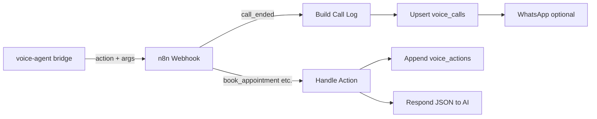

# Phase 1 setup guide

Phase 1 adds **long-call stability** (Gemini soft reset), **local RAG** (`lookup_knowledge`), and **structured Google Sheets logging** (one row per call + one row per mid-call action).

---

## What was added (code)

| Piece | File | Purpose |
|--------|------|--------|
| Soft session reset | `provider_gemini.py`, `bridge.py` | New Gemini Live session every N turns or M minutes, with a short **digest** so the caller is not lost |
| Call digest | `call_digest.py` | Builds digest text + detects `en` / `hi` / `mixed` for the sheet |
| Local RAG | `knowledge.search_knowledge()`, `tools.lookup_knowledge` | Keyword search over `data/business_knowledge.md` before answering niche questions |
| Rich call-end payload | `bridge.py` | Sends `call_id`, `duration_sec`, `direction`, `language`, `appointment_booked`, `lead_captured`, `follow_up` to n8n |
| n8n workflow | `n8n/voice_agent_actions.json` | Upsert `voice_calls`, append `voice_actions`, improved summary + WhatsApp |

---

## Step 1 — Update `.env`

Copy new variables from `.env.example`:

```env
GEMINI_SOFT_RESET_EVERY_TURNS=12
GEMINI_SOFT_RESET_EVERY_SEC=240
GEMINI_DIGEST_MAX_CHARS=1200

KNOWLEDGE_SEARCH_LOCAL_FIRST=true
KNOWLEDGE_SEARCH_MAX_CHARS=2000
```

| Variable | Meaning |
|----------|--------|
| `GEMINI_SOFT_RESET_EVERY_TURNS` | After this many **caller** utterances, refresh Gemini session (set `0` to disable) |
| `GEMINI_SOFT_RESET_EVERY_SEC` | Or refresh after this many seconds on one call (set `0` to disable) |
| `KNOWLEDGE_SEARCH_LOCAL_FIRST` | `lookup_knowledge` searches `data/business_knowledge.md` before calling n8n |

Restart the voice agent after changes:

```powershell
cd voice-agent
.\.venv\Scripts\activate
uvicorn app:app --host 0.0.0.0 --port 5000
```

---

## Step 2 — Google Sheet (two tabs)

1. Create a spreadsheet, e.g. **ResilienceSoft Voice Logs**.
2. Add tab **`voice_calls`** — row 1 headers from:

   `n8n/voice_calls_headers.csv`

3. Add tab **`voice_actions`** — row 1 headers from:

   `n8n/voice_actions_headers.csv`

4. Copy the **Sheet ID** from the URL:

   `https://docs.google.com/spreadsheets/d/SHEET_ID_HERE/edit`

### Column meaning (voice_calls)

| Column | Example |
|--------|---------|
| `call_id` | Exotel `call_sid` — **unique**; n8n upserts on this (no duplicate rows on retry) |
| `duration_sec` | `245` — use for charts/filters |
| `language` | `en`, `hi`, or `mixed` |
| `appointment_booked` / `lead_captured` | `yes` / `no` |
| `follow_up` | `appointment`, `callback`, `team_notified`, `none` |
| `conversation` | `Caller: …` / `Agent: …` lines |

### Column meaning (voice_actions)

One row each time the AI runs **book_appointment**, **create_lead**, or **send_notification** during the call.

---

## Step 3 — Import / update n8n workflow

1. In n8n: **Workflows → Import from file** → `n8n/voice_agent_actions.json`.
2. Open nodes **Upsert Voice Call Sheet** and **Append Voice Action Sheet**:
   - Set **Document** to your spreadsheet.
   - Select tabs `voice_calls` and `voice_actions`.
   - Attach your **Google Sheets OAuth** credential.
3. Set n8n environment variable (if you use WhatsApp):

   `RESILIOHUB_API_TOKEN` = your ResilioHub token

4. Activate the workflow.
5. Confirm `N8N_WEBHOOK_URL` in `.env` matches the webhook URL (path `voice-agent`).

### Flow diagram



---

## Step 4 — Test checklist

### A. Local RAG

1. Ask something specific that is only in `data/business_knowledge.md` (e.g. a service name).
2. In logs you should see tool `lookup_knowledge`.
3. AI should answer from file content, not invent prices.

### B. Long call / soft reset

1. Stay on a call **4+ minutes** or ask **12+ questions**.
2. Logs: `Gemini soft session reset`.
3. AI should briefly continue with context, not hang up.

### C. Sheets

1. End a call → one row in **`voice_calls`** with summary + conversation.
2. During a call, book an appointment → row in **`voice_actions`** + `appointment_booked=yes` on call end.
3. Trigger webhook twice with same `call_id` (test) → **one** row updated in `voice_calls` (upsert).

### D. WhatsApp

If `NOTIFY_WHATSAPP` is set, post-call message includes language, follow-up flags, and summary.

---

## Optional — Extended RAG in n8n or backend

Local search is enough for one markdown file. For **large** data:

1. Add tab **`knowledge_faq`** with columns: `topic`, `keywords`, `answer`.
2. In n8n, extend **`lookup_knowledge`** branch: Google Sheets **Lookup** or **HTTP Request** to your API.
3. Set `KNOWLEDGE_SEARCH_LOCAL_FIRST=false` only if n8n/backend should run first.

Example API contract (your backend):

```json
POST /api/knowledge/search
{ "query": "CRM pricing" }

→ { "results": "..." }
```

Return JSON in n8n `Handle Action` for `lookup_knowledge` so the AI gets `results` in the tool response.

---

## Troubleshooting

| Issue | Fix |
|--------|-----|
| Duplicate call rows | Use **Upsert** node; `call_id` column must exist and match |
| Empty summary | Fill `end_call` summary or rely on **Build Call Log** fallback from conversation |
| AI slow after 10 min | Lower `GEMINI_SOFT_RESET_EVERY_TURNS` (e.g. `8`) or `GEMINI_SOFT_RESET_EVERY_SEC` (e.g. `180`) |
| `lookup_knowledge` empty | Expand `data/business_knowledge.md`; keep sections short with clear headings |
| n8n sheet errors | Sheet tab names exact: `voice_calls`, `voice_actions`; header row matches CSV |

---

## Phase 2 preview

Paid ExoPhone, agent-first routing, outbound calls — see project README. Phase 1 does not change Exotel applet config.
